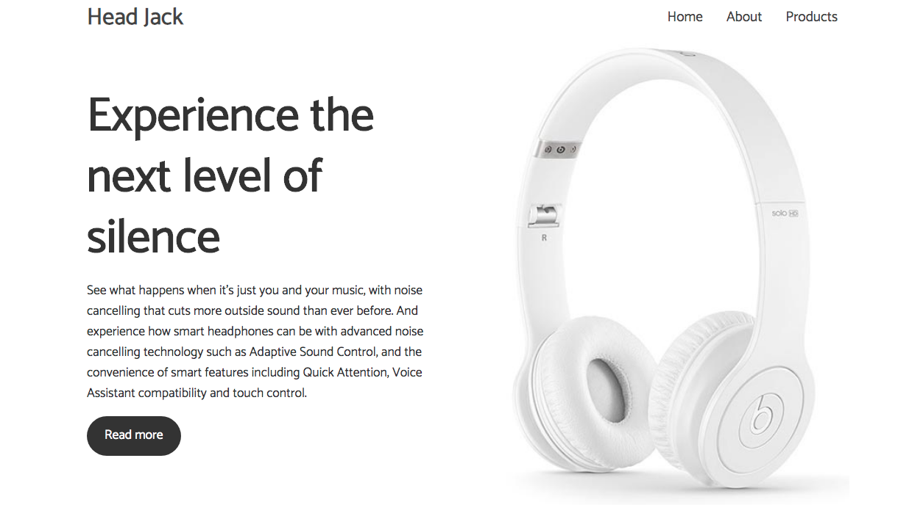
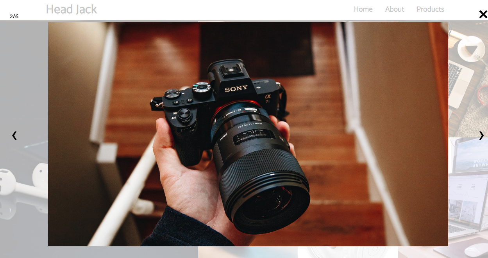

# Project Title

Website showcasing the ideal headphones for your gadgets and for all activities. Experience the next level of silence

# Motivation for this project

I wanted to use CSS grid to structure the website and it came out looking good. All gratitude goes to [Brad Traversy](https://www.youtube.com/watch?v=61R5kn_kYwY&t=1702s)

# Getting Started

You need to have basic understanding of HTML, CSS, and Javascript. The project was built using CSS grid and flexbox.

Other necessary tools used throughout the project were.

* SimpleLightBox by André Rinas - A touch friendly image lightbox. See it in action [here](https://simplelightbox.com/)

To use it in your project, download it and use in your script tag.

* Make sure you input the script src, [jQuery](https://jquery.com/) in before the closing body tag of your html

* Fontawesome

# Deployment

[Netlify](https://app.netlify.com)

# Author

Teri Eyenike

Follow me on social
[Twitter](https://twitter.com/terieyenike)

[Github](https://github.com/terieyenike)